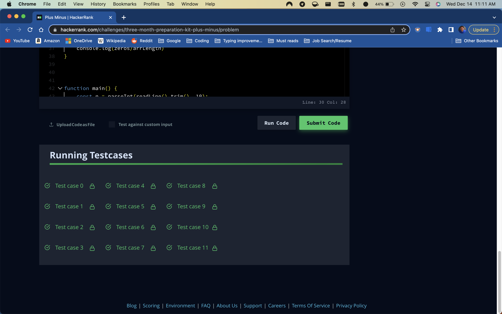

```
  function plusMinus(arr) {
    // Write your code here
    const arrLength = arr.length   
    const positive = arr.filter((a,i) => a >= 1 ).length
    const negative = arr.filter((a,i) => a <= -1).length
    const zeros = arr.filter((a,i) => a == 0).length
    console.log(positive/arrLength)
    console.log(negative/arrLength)
    console.log(zeros/arrLength)
  }
  
```




The questions requires that the numnber of positive integers, negative intergers and number zero be quantified by how many there are within any given array and divide that number by the total length of the array. Basically, calculate the ratios of its elements.

First, I stored the total length of the arr parameter within a variable call arrLength, this variable will later be used as a demoninator. 
Then, I wanted to seperate the arr parameter into three distinct arrays: one holding just positive values, another holding negative values and one to hold zero values. For this, I used the .filter to acquire what I needed for that specific array and disregard the other values. Next, I attached a .length to quantify the length of each new array. Once I have the new arrays and their lengths, I take that number and divide that with the arrLength value and that will produce the ratio of positive, negative and zero values within the array. 

Looking at the code, there is a redundency regarding the use of .filter for three seperate occasion. Would rather try to refactor the code to reduce the DRY code and simplify it. Also, I had to console.log the results rather then return the results because an error kept popping up. Would like to refactor that as well. 